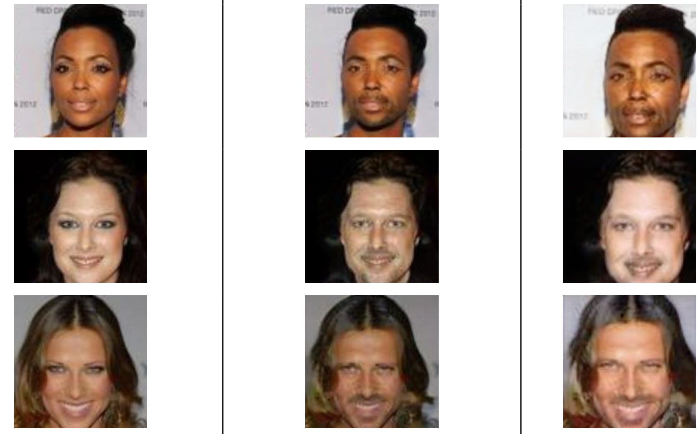

# Unsupervised Image to Image Translation using Attention guided Cycle GANs

This repository contains the TensorFlow code for our project based on a NeurIPS 2018 paper [“Unsupervised Attention-guided Image-to-Image Translation”](https://arxiv.org/pdf/1806.02311.pdf), which in part is based on the TensorFlow implementation of CycleGAN provided by [Harry Yang](https://github.com/leehomyc/cyclegan-1).

The results are sensitive to the initialization, may require training the model multiple times.

# Attention in CycleGAN
By leveraging attention, our architecture (shown in the figure bellow) only maps relevant areas of the image, and by doing so, further enhances the quality of image to image translation.

Our model architecture is defined as depicted below, please refer to the paper for more details: 


## Mapping results

We have filtered the [CelebA](http://mmlab.ie.cuhk.edu.hk/projects/CelebA.html) dataset into male and female subsets using gender defining attributes such as mustache, beard, makeup etc.

Sample images:


## Parameter tuning

The experiments were carried out at 100 epochs and batch size of 1. After analyzing the attention maps generated during training we found out that the maps generation was good till epoch 40 and after that the attention maps began to distort, so we let the attention module learn till epoch 40, till then the discriminator was trained using the full image, and after epoch 40 it was trained using the foregrounds only.
A threshold is used in the network for feeding the foreground to the discriminator that restricts the discriminator to be distracted by very small values.
According to our application we set the value of that threshold to 0.05.


### Our learned attention maps

The figure bellow displays automatically learned attention map:
Input Image (left), Learned Attention Map (middle), Translated Image (right)


## Our Results
Input Image (left), Output from CycleGAN (middle), Our Output (right)




## Quantitative Scores
The FID (Frechet Inception Distance) between original and fake generated images:


### How To Run this Code:
### Prepare dataset

* To use your own dataset: put images from each domain at folder_a and folder_b respectively. 

* Create the csv file as input to the data loader. 
	* Edit the [```cyclegan_datasets.py```](cyclegan_datasets.py) file. For example, if you have a horse2zebra_train dataset which contains 1067 horse images and 1334 zebra images (both in JPG format), you can just edit the [```cyclegan_datasets.py```](cyclegan_datasets.py) as following:
		```python
		DATASET_TO_SIZES = {
		  'horse2zebra_train': 1334
		}
		PATH_TO_CSV = {
		  'horse2zebra_train': './AGGAN/input/horse2zebra/horse2zebra_train.csv'
		}
		DATASET_TO_IMAGETYPE = {
		  'horse2zebra_train': '.jpg'
		}
		``` 
	* Run create_cyclegan_dataset.py:
		```bash
		python -m create_cyclegan_dataset --image_path_a='./input/horse2zebra/trainB' --image_path_b='./input/horse2zebra/trainA'  --dataset_name="horse2zebra_train" --do_shuffle=0
		```
### Training
* Create the configuration file. The configuration file contains basic information for training/testing. An example of the configuration file could be found at [```configs/exp_01.json```](configs/exp_01.json).

* Start training:
	```bash
	python main.py  --to_train=1 --log_dir=./output/AGGAN/exp_01 --config_filename=./configs/exp_01.json
	```
* Check the intermediate results:
	* Tensorboard
		```bash
		tensorboard --port=6006 --logdir=./output/AGGAN/exp_01/#timestamp# 
		```
	* Check the html visualization at ./output/AGGAN/exp_01/#timestamp#/epoch_#id#.html.  

### Restoring from the previous checkpoint
```bash
python main.py --to_train=2 --log_dir=./output/AGGAN/exp_01 --config_filename=./configs/exp_01.json --checkpoint_dir=./output/AGGAN/exp_01/#timestamp#
```

### Testing
* Create the testing dataset:
	* Edit the cyclegan_datasets.py file the same way as training.
	* Create the csv file as the input to the data loader:
		```bash
		python -m create_cyclegan_dataset --image_path_a='./input/horse2zebra/testB' --image_path_b='./input/horse2zebra/testA' --dataset_name="horse2zebra_test" --do_shuffle=0
		```
* Run testing:
	```bash
	python main.py --to_train=0 --log_dir=./output/AGGAN/exp_01 --config_filename=./configs/exp_01_test.json --checkpoint_dir=./output/AGGAN/exp_01/#old_timestamp# 
	```
